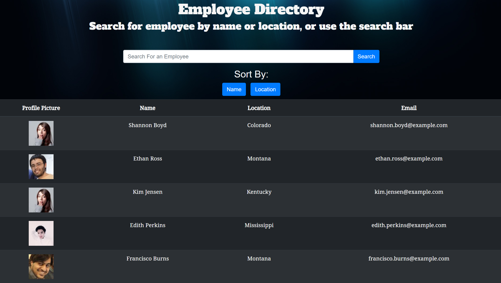

# Employee-Directory

## Description

This app will give the user the ability to sort employees on a table by different catagories: name, email, DOB, etc.  The user will also be able to search for an employee by one property.

## Local Deployment

-Clone repo onto your machine.

**-Important: Check `package.json` file to make sure `react-scripts` is an up-to-date version.  (For my machine, I needed to run v2.1.8 for `react-scripts`).**

-Run `npm install` or `npm i`.

-Run `npm start`.

-Navigate to the local host listed after running the command above (usually localhost:3000).

-Search names by typing into the Search Box, or click on the `Name` button or `Location` button to filter first names and locations alphabetically.

## Deployed Web Page

You can find the live site here: https://shielded-escarpment-44226.herokuapp.com/

## Built with

-HTML

-Bootstrap CSS

-Javascript

-React

## Packages Used

-React

-React-dom

-React-router-dom

-React-scripts

-Axios

## Image of Deployed Site

